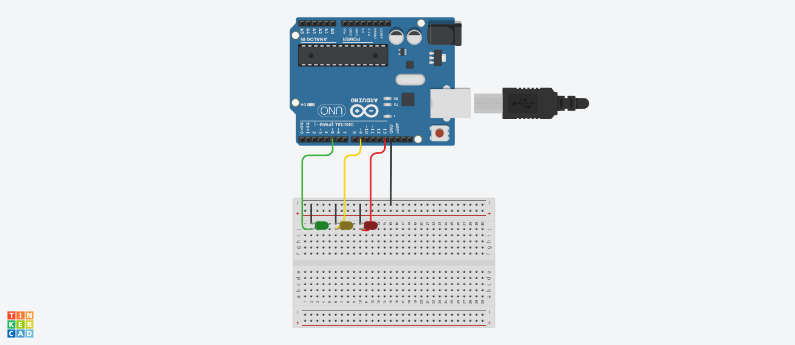

# About
This Arduino code blinks three LEDs in a repeating pattern. The LEDs are connected to digital pins 13, 9, and 5 on the Arduino board and are referred to as "led1", "led2", and "led3" in the code.

This is a fun and easy code  when getting started with arduino.

## What you will need
An arduino Uno\
Three leds of differnt colors \
Jumper cables \
Bread board

## Circuit setup



## Code breakdown

In the **setup()** function, the **pinMode** function is called for each of the three LEDs to configure them as outputs.

```c++
void setup() {
  // put your setup code here, to run once:
  pinMode(led1,OUTPUT);
  pinMode(led2,OUTPUT);
  pinMode(led3,OUTPUT);
}
```
The **loop()** function contains the code that will be repeatedly executed. It first blinks "led1" on and off 10 times, with a delay of 100 milliseconds between each change in state. It then does the same for "led2" and "led3". The pattern repeats indefinitely.
```c++
void loop()
{

}
```

The **digitalWrite** function is used to turn the LEDs on and off. When called with the HIGH argument, it turns the LED on, and when called with the LOW argument, it turns the LED off. The **delay** function is used to pause the program for a specified number of milliseconds.
```c++
void loop()
{
  digitalWrite(led1,HIGH);
  delay(100);//100 milliseconds.
  digitalWrite(led1,LOW);
  delay(100);
}
```
## Thanks
I hope you enjoy playing around with this project as i did too,\
you can try playing around with the **delay** to create different patterns.
