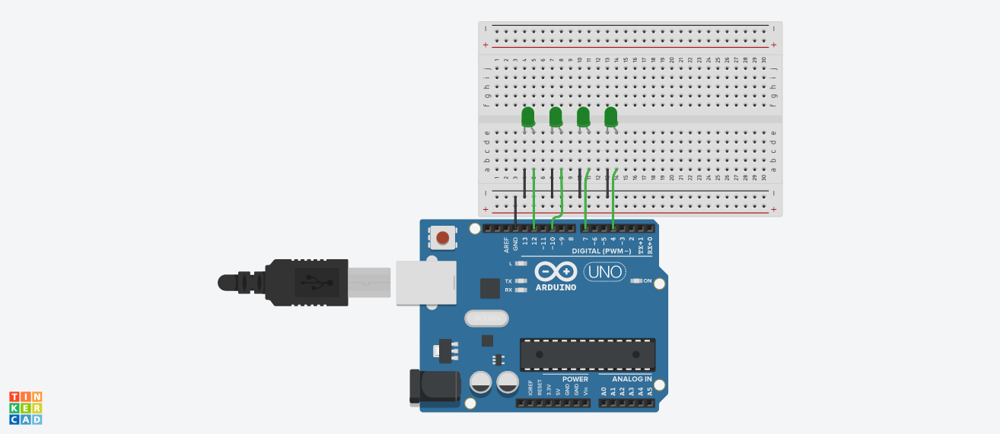

# About
This code displays the binary numbers 0 through 15 on four LEDs.

The binary numbers displayed in this code are unsigned integers, which means they are non-negative whole numbers represented in base-2. The values of the numbers are determined by the combination of the four LEDs that are illuminated.


For example, when led1, led2, and led4 are set to HIGH and led3 is set to LOW, the binary number "1101" is displayed, which is the decimal number 13. When all of the LEDs are set to LOW, the binary number "0000" is displayed, which is the decimal number 0. When all of the LEDs are set to HIGH, the binary number "1111" is displayed, which is the decimal number 15.

## What you will need

An arduino Uno\
Four leds \
Jumper cables \
Bread board

## Circuit setup



## Code breakdown

The variables led1, led2, led3, and led4 are assigned the values 12, 10, 7, and 4, respectively. These values represent the digital pins on an Arduino or similar microcontroller that the LEDs are connected to.

```c++
int led1=12;
int led2=10;
int led3=7;
int led4=4;
```
In the **setup()** function, the pin mode of each of these pins is set to OUTPUT, indicating that they will be used to output voltage to drive the LEDs.

```c++
  pinMode(led1,OUTPUT);
  pinMode(led2,OUTPUT);
  pinMode(led3,OUTPUT);
  pinMode(led4,OUTPUT);
```
In the loop function, the **digitalWrite()** function is used to set the voltage of each of the pins to either HIGH or LOW. When a pin is set to HIGH, it outputs a voltage and the LED connected to it will be illuminated. When a pin is set to LOW, it does not output a voltage and the LED will not be illuminated.

By setting different combinations of the pins to **HIGH** and **LOW**, different binary numbers can be displayed on the LEDs. For example, when led1, led2, and led4 are set to HIGH and led3 is set to LOW, the binary number "1101" is displayed, which is the decimal number 13.

```c++
  //13
  digitalWrite(led1,HIGH);
  digitalWrite(led2,LOW);
  digitalWrite(led3,HIGH);
  digitalWrite(led4,HIGH);
```

The delay function is used to pause the code for a certain number of milliseconds between each iteration of the loop, allowing the binary numbers to be displayed for a certain amount of time before moving on to the next number.

```c++
  //13
  digitalWrite(led1,HIGH);
  digitalWrite(led2,LOW);
  digitalWrite(led3,HIGH);
  digitalWrite(led4,HIGH);
  delay(2500);
  //14
  digitalWrite(led1,LOW);
  digitalWrite(led2,HIGH);
  digitalWrite(led3,HIGH);
  digitalWrite(led4,HIGH);
  delay(2500);
```


 # Thanks🤖

 I hope you like this project.
 Try adding more leds to display more binary numbers

