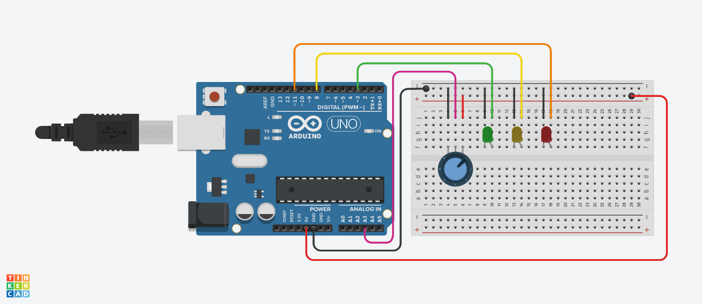

# About
This Arduino code reads the voltage from a potentiometer connected to pin A2, and controls three LEDs connected to pins 3, 8, and 11 based on the value of the voltage. The code sets up serial communication and sets the pin modes for the LEDs and potentiometer in the setup function. In the loop function, it reads the voltage from the potentiometer, converts it to a voltage using a formula, and turns on the appropriate LED based on the value of the voltage. The code also prints the value of the voltage to the serial monitor.

## What you will need
An Arduino board (such as an Arduino Uno).\
A potentiometer.\
Three LEDs (green, yellow, and red).\
Jumper wires to connect the components to. the Arduino.\
A breadboard to connect the components.

## New concepts

<h2><u>AnalogRead</u></h2>
The analogRead function is a built-in function in the Arduino language that is used to read an analog value from a specified pin on the Arduino board. Analog values are values that can vary continuously within a certain range, as opposed to digital values which can only be either on or off.

For example, an analog value could be the value of a potentiometer, which can be turned to any position within its range, or the value of a temperature sensor, which can measure temperatures within a certain range.

To use the analogRead function, you simply specify the pin number as the parameter. The function returns an integer value between 0 and 1023, with 0 representing the minimum value and 1023 representing the maximum value. The actual value being read is dependent on the type of sensor or device being used and its range.

For example, if you want to read the analog value from pin A2, you would use the following code:
```c++
int analogValue = analogRead(A2);
```

This would assign the analog value being read from pin A2 to the integer variable "analogValue". You can then use this value in your code to control other devices or perform calculations.
<h3><u>The  potentiometer</u></h3>

The potentiometer unlike other resistors has three terminals as shown below.

**Note:** The middle terminal should always be connected to the input.


<h3><u>Serial communication</u></h3>
Serial communication in this code refers to the process of sending and receiving data between the Arduino and a computer via a serial connection. Serial communication allows the Arduino to send data to the computer, such as the value of the voltage being read from the potentiometer, and the computer to send data to the Arduino, such as commands to control the LEDs.

## Circuit Setup


## Code breakdown

The code starts by defining the pins for the LEDs and potentiometer, and setting up serial communication. In the setup function, it also sets the pin modes for the LEDs and potentiometer.
```c++
int green =3;
int yellow =8;
int red = 11;
int meter = A2;
float V;
int output;
int sec=1000;
void setup() {
  // put your setup code here, to run once:
  pinMode(green,OUTPUT);
  pinMode(red,OUTPUT);
  pinMode(yellow,OUTPUT);
  pinMode(meter,INPUT);
  Serial.begin(9600);
  
}
```

In the loop function, the code reads the voltage from the potentiometer using the analogRead function. It then converts this value to a voltage using the formula V = (5/1023)*output, where output is the value read from the potentiometer and V is the resulting voltage.
```c++
void loop() {
  // put your main code here, to run repeatedly:
  output=analogRead(meter);
  V=(5./1023.)*output;
}
```

The code then checks the value of V and turns on the appropriate LED based on the following conditions:

If V is less than or equal to 3, the green LED is turned on
If V is greater than 3 but less than 4, the yellow LED is turned on
If V is greater than 4, the red LED is turned on
The code then waits for one second before repeating the loop and reading the voltage from the potentiometer again. This allows the LEDs to remain on for one second before the voltage is re-read and the appropriate LED is turned on again.
```c++
 if (V<=3){
    digitalWrite(green,HIGH);
    digitalWrite(red,LOW);
    digitalWrite(yellow,LOW);
    delay(sec);
  }
  if (V>3 && V<4){
    digitalWrite(green,LOW);
    digitalWrite(red,LOW);
    digitalWrite(yellow,HIGH);
    delay(sec);
  }
  if (V>4){
    digitalWrite(green,LOW);
    digitalWrite(red,HIGH);
    digitalWrite(yellow,LOW);
    delay(sec);
  }
```

Finally, the code prints the value of V to the serial monitor using the Serial.println function, allowing the user to see the current voltage being read from the potentiometer.
```c++
 Serial.print("The voltage is :");
 Serial.println(V);
 ```
# Thanks🤖
I hope you enjoy making this project as I did.
